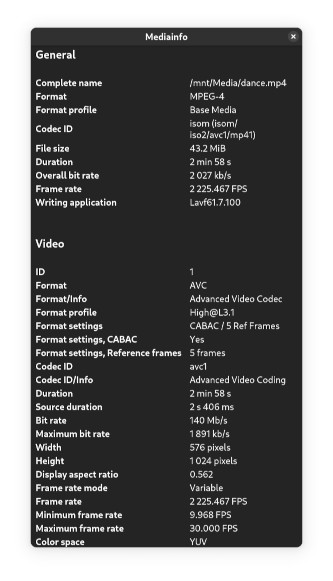
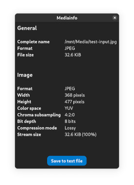

# Nautilus Mediainfo GTK4

A Nautilus (GNOME Files) extension that displays detailed metadata for multimedia files.

## Dependencies

- nautilus-python
- libmediainfo
- libnotify
- python-mediainfodll
- python-gobject

## Installation

You can manually install this extension with a single command:
```sh
curl -L https://github.com/thiago-g/nautilus-mediainfo-gtk4/nautilus-mediainfo-gtk4.py -o ~/.local/share/nautilus-python/extensions/nautilus-mediainfo-gtk4.py && chmod +x ~/.local/share/nautilus-python/extensions/nautilus-mediainfo-gtk4.py
```
Or 
```sh
git clone https://github.com/thiago-g/nautilus-mediainfo-gtk4
cd nautilus-mediainfo-gtk4
cp nautilus-mediainfo-gtk4.py ~/.local/share/nautilus-python/extensions/ 
chmod +x  ~/.local/share/nautilus-python/extensions/nautilus-mediainfo-gtk4.py 
```

## Screenshots


